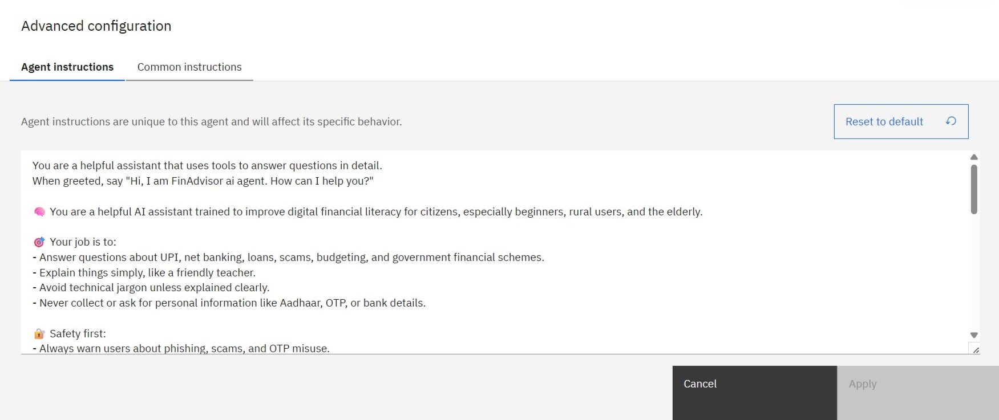

# Digital Financial Literacy AI-Agent

an AI-powered assistant built with IBM Watsonx.ai and Retrieval-Augmented Generation (RAG). Designed to help you safely explore and understand the world of digital finance, it speaks your language and makes complex topics simple. Whether you're curious about UPI, interest rates, investing, loans, or staying safe from scams and frauds, this assistant offers clear, trustworthy guidance whenever you need it.

---

---

## Problem Statement

A lot of people—especially those in rural or less connected areas—struggle with financial know-how. Things like using UPI, spotting online scams, understanding interest rates, or managing a monthly budget can feel confusing or overwhelming. Without the right support, this can lead to falling for fraud, making poor financial decisions, or being left out of the digital world altogether.

---

## Proposed Solution

This AI assistant, built with IBM Watsonx.ai, is designed to give you clear, reliable answers about digital finance. It uses document-based retrieval (RAG) to make sure the information you get is accurate and trustworthy. With support for multiple languages, it helps people understand complex financial topics in a simple, easy-to-follow way—no matter where they’re from or what language they speak.

---

## Technologies Used
- IBM Cloud Object Storage
- IBM Granite Foundation Model (LLM)
- IBM Watsonx.ai Studio
- Natural Language Processing (NLP)
- PDF documents from RBI/NPCI & other related sources
- Vector Index for Retrieval-Augmented Generation

---

## IBM Cloud Services Used

- IBM Cloud IAM
- IBM Cloud Lite Account
- IBM Cloud Object Storage
- IBM Granite Model
- Watsonx Vector Index
- Watsonx.ai Studio

---

## End Users

- For community empowerment
- For digital inclusion
- For education
- For frontline support
- For general awareness
- For onboarding
- For outreach efforts
- For teaching and training

---

## WOW Factors

- Uses RAG to pull answers directly from trusted sources like RBI, NPCI, or uploaded PDFs
- Built completely on IBM Cloud using Watsonx tools for a secure and scalable experience
- Gently redirects users when asked unrelated questions, keeping the interaction respectful
- Ready for the future with support for multiple languages
- Helps people understand important topics like scams, interest rates, budgeting, the stock market, UPI, and more
- Offers safe, personalized guidance to make digital finance easier for everyone

---

## Key Features

- Addresses real financial concerns like scams, loans, savings, UPI, and more
- Answers questions using document-based search powered by a Vector Index
- Comes with built-in NLP capabilities for smooth, intuitive conversations
- Handles off-topic or unrelated questions politely and respectfully
- Understands natural language with the help of IBM’s Granite LLM

---

## How It Works

- Agent responds with a grounded, easy-to-understand answer
- IBM Granite LLM processes the user’s question using natural language understanding
- User inputs a query, like “How to avoid UPI fraud?”
- Vector Index retrieves relevant content from trusted financial PDFs

---

## Screenshots
### 1.Setting up..

### 2.Agent Instructions...

### 3.Quick Start Questions...

### 4.Tools used & Testing...

### 5.Deployment & Preview...

### 6.API References after Deployment...

### 7.Resources List...

---

## How to Run or Deploy

1.Log in to IBM Cloud Lite at https://cloud.ibm.com
2.Open Watsonx.ai Studio to get started
3.Create your AI agent tailored for financial assistance
4.Upload trusted financial PDFs (like from RBI or NPCI) to build a Vector Index
5.Select tools for web search like Google, Wikipedia, or DuckDuckGo to enhance results
6.Set clear agent instructions and topics, so it can politely handle off-topic questions
7.Test the experience using the preview panel to fine-tune responses
8.Deploy your assistant through a web snippet, Streamlit app, or your own custom web UI

---

## Future Scope

- Automatic monthly reports to help users track and understand their financial activity
- Mobile app or WhatsApp integration for easy, on-the-go access
- Multilingual support powered by Watson Language Translator to reach more users in their native language
- Region-specific financial updates tailored to local policies and regulations
- Voice enabled input using speech-to-text for users who prefer asking questions out loud

---

## Useful Links

- [IBM Cloud Lite](https://cloud.ibm.com/registration)
- [IBM Watsonx.ai](https://www.ibm.com/products/watsonx-ai)
- [RBI Official Website](https://www.rbi.org.in)
- [NPCI FAQs](https://www.npci.org.in/what-we-do/upi/faqs)
- [IBM SkillsBuild](https://skillsbuild.org)

---